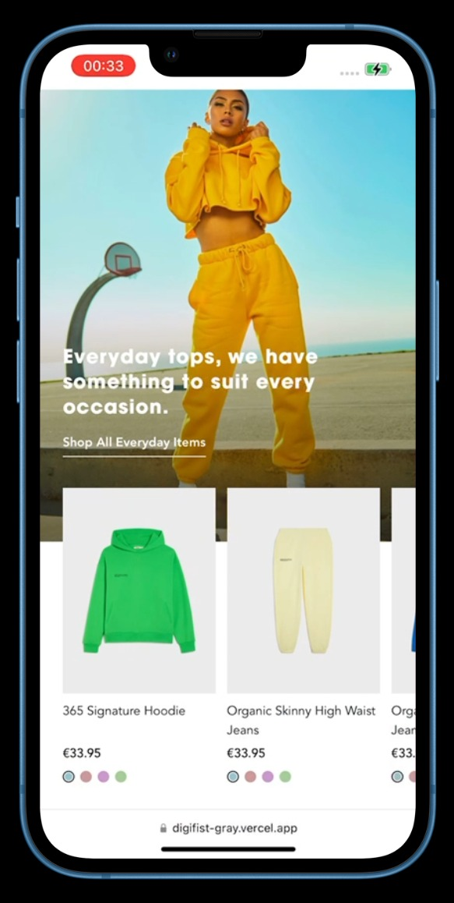

## Content

- [Introduction](#introduction)
- [About This Project](#about-this-project)
- [Previews](#previews)

<br>

# Introduction

- This repo has been created for Digifist Frontend Case by using HTML, CSS and Javascript.
- This documentation will help you to understand what i utilize while i was developing this project and my approach.
- And You will find out why i use the some features in the project and why didn't and can't use some of features.
- And also you will find demo link to test the project in live environment.

<br>

## About This Project

 I paid attention to accessibility (a11y) and design in pixel perfect design when creating this project. Although code is quite important for us (as developer), we intract with the end-user. Readibility of code or clean code doesn't matter for the end-user, we can ensure that the end user experiences an incredible experience on our website with pixel perfect desing.

 In case of accessibility, I started to develop the project by using Semantic Html. I used the tags like  main, section and picture as you can see in the code-base. These tags are quite important for seo and accessibility.

 There is only one image given in figma but I added 3 pictures for the main banner to the project from the figma file of the project. I used picture tag and srcset to allow the browsers to load optimal image size for width of browsers. I preferred to use picture tag instead of img tag. Because I wanted to use srcset in the project and added different image sources in different resolution. Avif and webp formats are currently used in the websites. But I didn't want to convert the images to another format as the quality of the picture would be degraded.

 In css section of the project, First I defined some variables for the spacing, font-family and color values. so that I could manage and calculate the colour and spacing settings more easily.

  ```
  :root {
    --c-primary: #000000;
    --c-secondary: #ffffff;
    --c-text: #666666;
    --c-blue: #99c3cc;
    --c-pink: #cc9999;
    --c-purple: #cb99cc;
    --c-green: #a6cc99;
  
    --font-family--primary: Avenir, sans-serif;
    --font-family--secondary: Avantgarde, sans-serif;
  
    --spacer-1: 4px;
    --spacer-2: 8px;
    --spacer-3: 16px;
    --spacer-4: 32px;
    --spacer-5: 68px;
  }
  ```

  I tried to name variables and class names as properly and correctly as I could. I followed the Bem convention while naming the class name. If I could utilise SCSS preprocessor, I could create more readable and clear css files for the project. But The Project had to develop HTML,JS and CSS without relying on development frameworks or build processes. I didn't want to use CSS Nesting feature for the Native CSS since it doesn't support by some browsers. 
  
  I preferred to use SwiperJS for the slider. I followed documentation of the SwiperJS and added necessarry javascript and style files to the project. I adjusted spacing value for each item and how many item should be shown in slider for the different breakpoints. That's why i added main.js file to the project. And also i added "a11y: true" for the accessibility to main.js

  I developed this project with mobile-first design approach. I couldn't see anything about font size specifically for the tablets (because the text was very small on the tablet), so I made some additional styling changes for the texts for tablet devices in css.

  Lastly, You can see how this project looks in the mobile and desktop devices and reach out the test link. You can also clone this repo following;
  ```sh
  git clone https://github.com/yigitden/digifist.git
  ```

# Previews 
 
 You can see some screenshots of test devices. I used Safari as browser in iPad and iPhone and Chrome as browser in Samsung Phones and Tablets.

 Test Link [Test] (https://digifist-gray.vercel.app/)
<center>

## iPhone 14


## iPhone 13



## iPhone 14 Pro Max


## iPad Pro 12.9 2022


## iPad Mini 2021


## Samsung Galaxy S23


## Samsung Galaxy Tab S8


